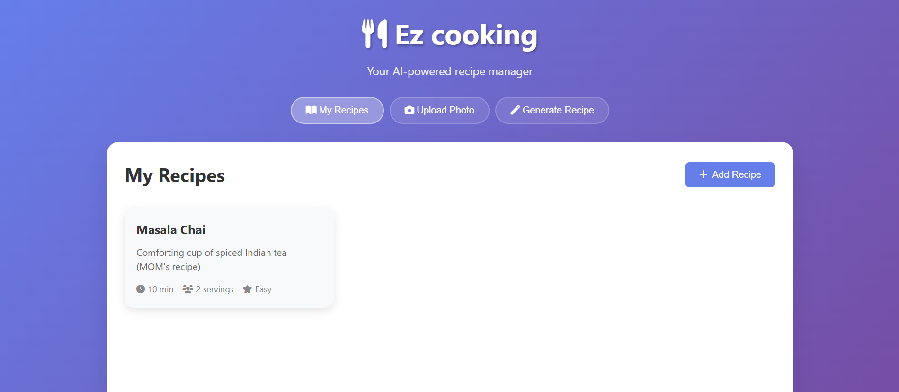
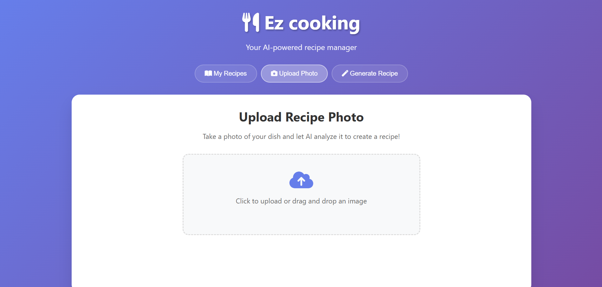
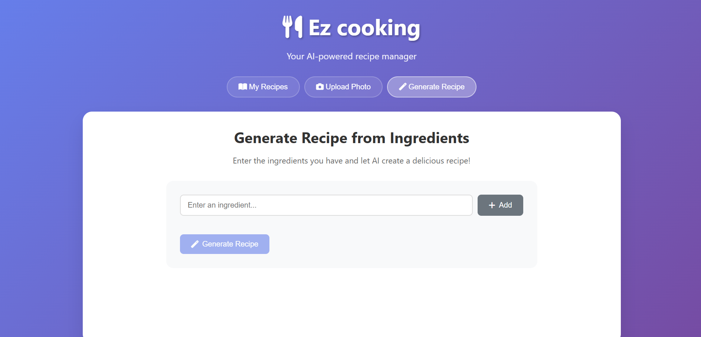

# Ez Chef - Your AI-Powered Recipe Manager 🍳🌶️

Welcome to Ez Chef, the app that finally solves the ultimate kitchen puzzle: "What can I make with leftover dal, a bit of paneer, and a spice box full of mysteries?" Stop endlessly scrolling for recipes and let our AI be your new kitchen sidekick. With the magic of GPT-4 Vision, you can turn a photo of that delicious Dal makhni from your friend's wedding into tonight's dinner, or challenge our AI to create some 'jugaad' magic from your pantry's treasures. Your culinary adventure starts now no 'MasterChef' title needed!

## ✨ Features

-   **Recipe Management**: Your personal digital cookbook. Add, view, edit, and delete recipes without losing that precious scrap of paper.
-   **AI Image Analysis**: Snap a photo of a dish, and our AI wizard will conjure up the recipe. It's basically magic.
-   **Recipe Generation**: Throw your random ingredients at our AI. It’ll turn that lonely turnip and half-jar of olives into a surprisingly tasty meal.
-   **Modern UI**: A sleek, responsive interface with fancy drag-and-drop functionality that's a pleasure to use.
-   **Local Storage**: Your secret family recipes are safe and sound on your local machine with an SQLite database.

## Screenshot





## 🛠️ Tech Stack

-   **Backend**: Python Flask
-   **Database**: SQLite with SQLAlchemy ORM
-   **Frontend**: Vanilla JavaScript, HTML5, CSS3
-   **AI/ML Integration**: OpenAI API (GPT-4, GPT-4 Vision)
-   **Styling**: Custom CSS with Font Awesome icons

## ✅ Prerequisites

-   Python 3.8 or higher
-   An OpenAI API key (this is where the magic comes from!)

## 🚀 Installation

1.  **Clone the repository**
    ```
    git clone <your-repo-url>
    cd ez-chef
    ```

2.  **Install Python dependencies**
    ```
    pip install -r requirements.txt
    ```

3.  **Set up environment variables**
    Create a `.env` file in the root directory. Don't worry, we have a template for you (`env.example`).
    ```
    OPENAI_API_KEY=your_openai_api_key_here
    SECRET_KEY=your_super_secret_key_here
    ```
    Or, if you prefer living on the edge, set them in your terminal:
    ```
    # Windows
    set OPENAI_API_KEY=your_openai_api_key_here
    set SECRET_KEY=your_super_secret_key_here
    
    # Linux/Mac
    export OPENAI_API_KEY=your_openai_api_key_here
    export SECRET_KEY=your_super_secret_key_here
    ```

4.  **Run the application**
    ```
    python app.py
    ```

5.  **Access the application**
    Open your favorite browser and head to `http://localhost:5000`.

## 👨‍🍳 Usage

### Adding Recipes Manually
1.  Click the "Add Recipe" button.
2.  Fill in the details. Try not to get distracted by hunger.
3.  Click "Save Recipe" to immortalize your creation.

### Analyzing Recipe Photos
1.  Go to the "Upload Photo" tab.
2.  Drag and drop an image or click to upload.
3.  Click "Analyze Image" and watch the AI work its magic.
4.  Review the recipe and save it before you forget what it was.

### Generating Recipes from Ingredients
1.  Navigate to the "Generate Recipe" tab.
2.  List the ingredients you have on hand.
3.  Click "Generate Recipe" to see what culinary masterpiece the AI invents.
4.  Review, save, and pretend you came up with it yourself.

## 🔌 API Endpoints

-   `GET /api/recipes`: Get all your delicious recipes.
-   `POST /api/recipes`: Add a new recipe to your collection.
-   `GET /api/recipes/<id>`: Get a single recipe.
-   `PUT /api/recipes/<id>`: Update a recipe (because you found a better way to do it).
-   `DELETE /api/recipes/<id>`: Say goodbye to a recipe.
-   `POST /api/upload-image`: The image-to-recipe magic endpoint.
-   `POST /api/generate-recipe`: The ingredient-to-recipe wizardry endpoint.
-   `POST /api/ai-chef`: Your personal AI cooking assistant.
-   `GET /api/health`: Check if the app is still kicking.

## 📜 License

This project is licensed under the MIT License. Cook, share, and modify to your heart's content!

